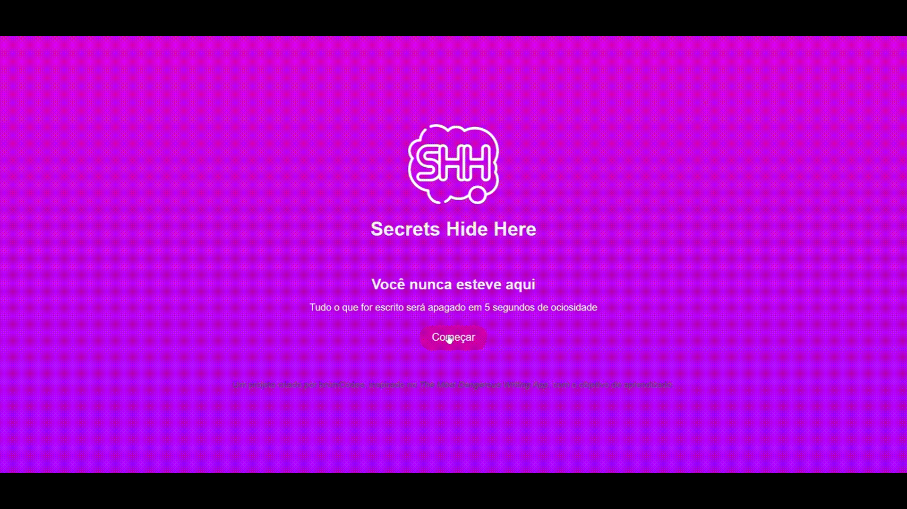

# Shh (Secrets Hide Here)  
Um espaço para escrever o que as pessoas tem necessidade de expresar, mas não revelar. 

## Sobre o Projeto  
O **Shh** começou como uma tentativa de replicar (com fins de aprendizagem) o funcionamento do "The Most Dangerous Writing App", um site que busca incentivar a escrita contínua sem distrações, apagando o texto produzido depois de certos segundos de ociosidade. Mas, no meio do processo percebi uma possibilidade diferente para a mesma ferramenta.  

## GIF

## Funcionalidades  
É bem simples.
- Tudo o que for escrito é apagado em 5 segundos de ociosidade.
- Voltar a escrever durante o timer reinicia a contagem. 

## Como Acessar
O link está anexado.

## Próximos Passos
- Refinar a interface.
- Incorporar elementos visuais para destacar a contagem regressiva de forma mais clara.

  
